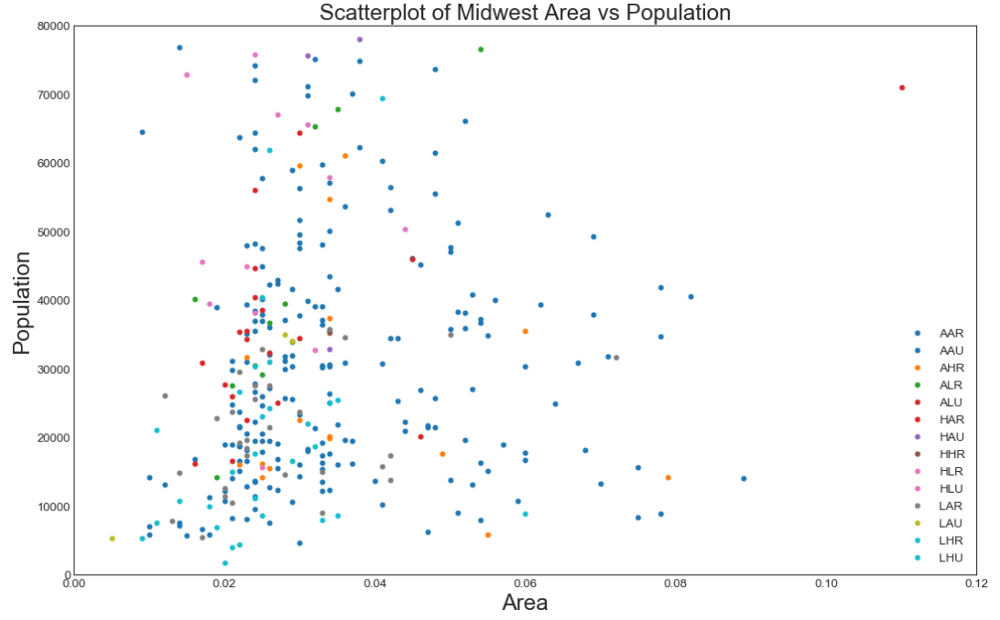

## 关联 （Correlation）
关联图表用于可视化2个或更多变量之间的关系。 也就是说，一个变量如何相对于另一个变化。

### 散点图（Scatter plot）
散点图是用于研究两个变量之间关系的经典的和基本的图表。 如果数据中有多个组，则可能需要以不同颜色可视化每个组。 在 matplotlib 中，您可以使用 plt.scatterplot（） 方便地执行此操作。


### 导入需要的模块库

```
# 导入numpy库
import numpy as np
# 导入pandas库
import pandas as pd
# 导入matplotlib库
import matplotlib as mpl
import matplotlib.pyplot as plt
# 导入seaborn库
import seaborn as sns
# 在jupyter notebook显示图像
%matplotlib inline
```
### 设定图像各种属性


```
large = 22; med = 16; small = 12
            # 设置子图上的标题字体
params = {'axes.titlesize': large,  
            # 设置图例的字体
          'legend.fontsize': med,
            # 设置图像的画布
          'figure.figsize': (16, 10),  
            # 设置标签的字体
          'axes.labelsize': med, 
            # 设置x轴上的标尺的字体
          'xtick.labelsize': med,  
            # 设置整个画布的标题字体
          'ytick.labelsize': med,
           # 整个画布的标题字体大小
          'figure.titlesize': large}  
# 更新默认属性
plt.rcParams.update(params)  
 # 设定整体风格
plt.style.use('seaborn-whitegrid')
# 设定整体背景风格
sns.set_style("white")  
```
### 测试版本


```
print(mpl.__version__)
print(sns.__version__)
```
3.1.0

0.9.0

#### 程序代码


```
# step1:导入数据
midwest = pd.read_csv("https://raw.githubusercontent.com/selva86/datasets/master/midwest_filter.csv")

# step2:准备数据和颜色
    # 使用np.unique对“midwest['category']” 去重
categories = np.unique(midwest['category'])
    # 使用列表推导式，建立colors列表。
colors = [plt.cm.tab10(i/float(len(categories) - 1)) for i in range(len(categories))] 

# step3:建立画布
            # 绘图尺寸，默认为（6.4,4.8）
plt.figure(figsize = (16, 10), 
            # 图像的分辨率，默认dpi为100
          dpi = 80,
            # 背景颜色，默认为白色
          facecolor = 'w',  
            # 边框颜色，默认为白色 
          edgecolor = 'k'      
          )

# step4:绘图
    # 使用函数enumerate：将可遍历的数据对象组合为一个索引序列，同时列出数据和数据索引
for i, category in enumerate(categories):
                # 横坐标名称，纵坐标名称
    plt.scatter("area", "poptotal",  
                # 程序会自动的从data提取data中"area"和"poptotal"数据
               data = midwest.loc[midwest.category == category,:],
                # 数据点大小
               s = 20,  
                # 设定颜色，若不转换为二维，会出现报错
               c = np.array(colors[i]).reshape(1, -1),  
                # 设定标签名称
               label = str(category)  
               )

# step5:装饰
    # 设定横轴坐标的范围（元组）
plt.gca().set(xlim = (0, 0.12), ylim=(0, 80000))
    # 设定x坐标轴上字体的大小
plt.xticks(fontsize = 12) 
    # 设定y坐标轴上字体的大小
plt.yticks(fontsize = 12)
    # 设定y坐标轴上的标题和字体大小
plt.ylabel('Population', fontsize = 22) 
    # 设定x坐标轴上的标题和字体大小
plt.xlabel("Area", fontsize = 22) 
    # 设定整个图像的标题和字体大小
plt.title("Scatterplot of Midwest Area vs Population", fontsize = 22) 
    # 设定图例的字体大小
plt.legend(fontsize = 12) 
plt.show()
```


### 散点图



